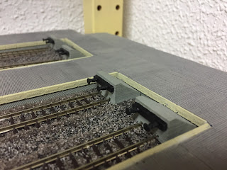
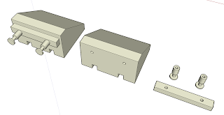
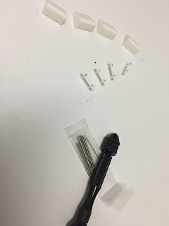
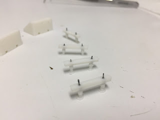

Today I shall put forward some details about the building of a concrete stop buffer with the 3d printer. These are the stop buffers as I remember at old Atocha Railway Station.  
  

  
  
We start working at computer. As I've said before, I use SketchUp to draw 3D models. The stop buffers are a really simple design. I've designed them simple, but we can complicate it with an accurate form of buffers.  If you work with bigger gauge, it will pay off.  
  

Here are the links to download files.  

*   [topeEstacion.skp](https://www.dropbox.com/s/bmzwy3o4kpiz7f6/topeEstacion.skp?dl=0)
*   [topeEstacion.stl](https://www.dropbox.com/s/5ytisa25czl2vvb/topeEstacion.stl?dl=0)

All measurements are correct for N gauge. Use it at H0 is as simple as scale it to  160/87=1,83.

  

Now it's time to let printer to work.

  

  

  

To aid in assembly, I've let several holes to centre the pieces with a small wire. Probably they need to go over with a [micro hand drill](https://www.amazon.co.uk/gp/product/B06XG1FY8P/ref=as_li_tl?ie=UTF8&camp=1634&creative=6738&creativeASIN=B06XG1FY8P&linkCode=as2&tag=littlerailway-21&linkId=0f42efcce03360929549cb369453b5c1).

  

  

  

  

All we need to do now is colour it. I was a little slacker, and I've painted black sleeper in conjunction with buffers, but could have done it separately painting sleeper with wood color.