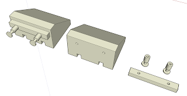

Os voy a detallar la construcción de un tope para la maqueta con la impresora 3D de extrusión. Concretamente estos son los topes tal y como los recuerdo en la antigua estación de Madrid-Atocha.  
 

Lo primero, por supuesto es el diseño delante del PC. Como ya he comentado otras veces, uso sketchup para ello. La ventaja del tope es que es bastante sencillo (Bueno, yo lo he hecho sencillo), pero podríamos complicarlo bastante más, con la forma más ajustada al tope usado por Renfe. Si trabajáis con una escala mayor, me imagino que el trabajo valdrá la pena.  

Aquí os dejo en enlace a los ficheros:  

*   [topeEstacion.skp](https://www.dropbox.com/s/bmzwy3o4kpiz7f6/topeEstacion.skp?dl=0)
*   [topeEstacion.stl](https://www.dropbox.com/s/5ytisa25czl2vvb/topeEstacion.stl?dl=0)

Las medidas son las apropiadas para escala N. Pasarlo a H0 sería tan sencillo como escalar por 160/87=1,83.

Ahora le toca trabajar a la impresora.

Para facilitar el montaje he dejado unos orificios para centrar usando un pequeño alambre. Probablemente haya que repasarlos con un [berbiquí en miniatura](https://www.amazon.es/gp/product/B01IEXTQJU/ref=as_li_tl?ie=UTF8&camp=3638&creative=24630&creativeASIN=B01IEXTQJU&linkCode=as2&tag=rpr0f-21&linkId=9b09f72de6aecb53f891ad8b47cf9174) como este comprado en Amazon .

Solo queda pintar. Yo he sido un poco vago y la traviesa la he pintado de negro junto a los topes, pero podría haberlo hecho por separado color marrón.