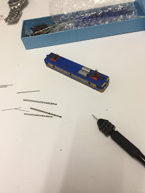
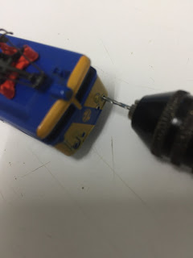
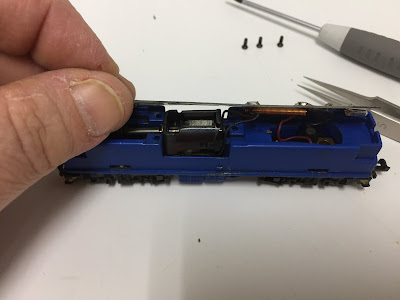
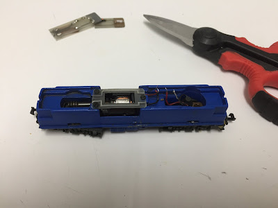
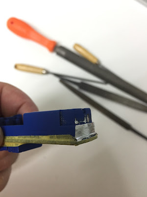
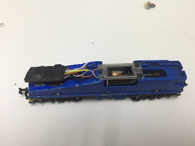
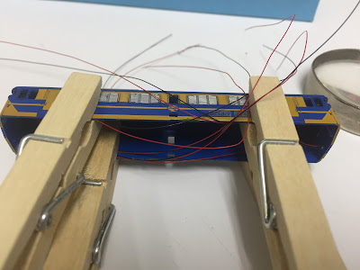

This week I've been busy converting to DCC a RENFE 269 - N gauge loco, that I bought last Sunday at [Madrid Railway Museum flea market](https://www.museodelferrocarril.org/findesemana/mercadillo.asp) .  
  
The first thing to do is to conduct a general maintenance. If loco works erratically at DC, it will be worse at DCC.  Then, we need to clean the energy collection system from the track, check that engine works fine, clean the gears, and replace the traction tyres.  
  
Regarding lighting, we will upgrade it and make more realistic.  Original loco only has got main headlamp, and we also want to make functional position lights.  To that end, I bought several micro-leds with wires from [Modelismo del Tren](http://www.modelismodeltren.com/smd-micro-cable/) at Zaragoza.  
  

  
For our model we need to make holes for position lamps, because they are originally blind. I use a [micro hand drill](https://www.amazon.co.uk/gp/product/B06XG1FY8P/ref=as_li_tl?ie=UTF8&camp=1634&creative=6738&creativeASIN=B06XG1FY8P&linkCode=as2&tag=littlerailway-21&linkId=0f42efcce03360929549cb369453b5c1) purchased from Amazon.  
  

  

  

And this is the result:

  

  

Are external position lamps white? Are red? [Here we can see an original example](https://farm6.static.flickr.com/5248/5258158264_38475ea94f_b.jpg).  
  
Inside of loco, we can see that all the space is occupied by an structure that works as frame, counterweight, and holds all components.  
  

  
We will remove the printed circuit that holds old bulb lighting and a couple of coils for the engine.  
  

  
As this board also fixes engine in its place, we need to trim it, allowing it to continue playing this role.  
  
The next step is look for enough room for the decoder.  
  

  
As we can see, we need to remove a part of metalic frame, and a plastic pivot that stand out from bogie. In the original design this pivot is butted against the printed circuit board to keep in place the current draw. If we see that the shaft doesn't fit strong in its stand, after filing it, we would need to fix it with a drop of glue.  
  

  
When we work with this frame, we need to be carefully with the visible details. It would be very difficult to redo the numbering.  
  

  
I've started filing the front, to leave place for the new leds.  
  

  
And then filed a great piece of frame to accommodate the controller.  
  

  
As you can see at the next picture, I've painted the filed surfaces so they don't look bad when we open the loco.  
  

  
It's time for electronics. I've selected a [76425 decoder from Uhlenbrock](https://www.amazon.co.uk/gp/product/B008RKQMMA/ref=as_li_tl?ie=UTF8&camp=1634&creative=6738&creativeASIN=B008RKQMMA&linkCode=as2&tag=littlerailway-21&linkId=e8441e0ab7f26fbfdebfc826916f495a). [Here is its documentation](http://www.uhlenbrock.de/de_DE/service/download/handbook/en/I4B050BD-057.apd/Bes76425e.pdf).  
  
This is the wire colour code for this decoder:  
  

)

  
We need to remove the connector, because we have nowhere to use it. I also will remove the green cable, unsoldering it, because I don't use Auxiliary function and there is no more room.  
  
Lets go to connect cables to the power source. First we need to decide what is the natural direction of travel, and then connect the black cable to left and red to right.  
  
As the space is like gold in this model, I try to keep cables as short as possible.  
  

  
For engine, we need to connect orange and grey.  
  

  
And then we can fix engine in its place with the board that we have cut.  
  

  
To avoid accidental shortcuts, I've protected the decoder with thermo-retractile insulation.  
  

  
As we can see, there are now 3 free cables for lighting. Blue - common,  white for forward operation and yellow for rear operation.  
  
We are using leds, then we need to know that current flows from blue common (positive) to white and yellow (negative). We need to polarize leds connecting anode to blue and cathode to its correspondent white or yellow. .  
  
To limit the current, I use two small [1k2 -1/8W resistors](https://www.amazon.co.uk/gp/product/B00EZMBG3O/ref=as_li_tl?ie=UTF8&camp=1634&creative=6738&creativeASIN=B00EZMBG3O&linkCode=as2&tag=littlerailway-21&linkId=c622fae072c09450b34d7d10508d59a9).  
  
We also need to keep in mind that using leds we can't connect it in parallel, because there are subtle differences in its polarization parameters and some of them can drain all current and leave others without lighting. Then we need to cable it serial.  
  
You can see at the next image the "cable spaghetti" created by 10 leds in such small model.  
  

  
And finally the work completed, with leds connected to the decoder.  
  

  

