Esta semana me he dedicado a hacer la conversión a DCC de la locomotora RENFE 269 en escala N  que compré el domingo en el [mercadillo de modelismo](https://www.museodelferrocarril.org/findesemana/mercadillo.asp) del Museo del Ferrocarril.  
  
Lo primero es hacer un mantenimiento general de la locomotora. Si funciona erráticamente en AC, va a ser peor en DCC. Así que hay que limpiar el sistema de recogida de energía de la vía, comprobar que el motor funciona correctamente, limpiar la transmisión y ya de paso cambiar los aros de adherencia.  
  
En cuanto a la iluminación, vamos a hacerla más realista y moderna. La locomotora original solo encendía la farola, pero también vamos a hacer funcionales los faros inferiores y las luces de posición. Para ello he comprado unos micro led con cable en la tienda [Modelismo del Tren](http://www.modelismodeltren.com/smd-micro-cable/) de Zaragoza.  
  

[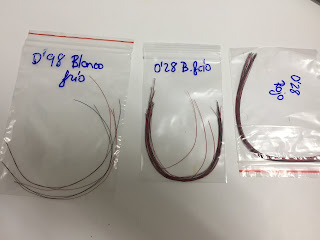](IMG_4110_big.jpeg)

  
En el modelo, hemos de realizar taladros en los faros, que por ahora son ciegos. para ello uso un [berbiquí en miniatura](https://www.amazon.es/gp/product/B01IEXTQJU/ref=as_li_tl?ie=UTF8&camp=3638&creative=24630&creativeASIN=B01IEXTQJU&linkCode=as2&tag=rpr0f-21&linkId=9b09f72de6aecb53f891ad8b47cf9174) comprado en Amazon.  
  

[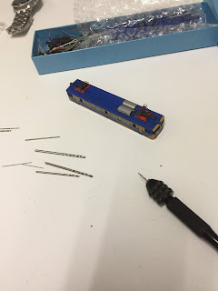](IMG_4107_big.jpeg)

  

[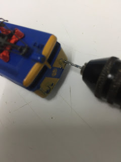](IMG_4106_big.jpeg)

  

Finalmente así quedan los agujeros:

  

[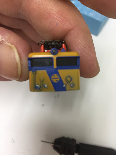](IMG_4108_big.jpeg)

  

De los faros inferiores, los exteriores son blancos según se puede ver en fotos como [esta de flick](https://farm6.static.flickr.com/5248/5258158264_38475ea94f_b.jpg).  
  
En el interior de la locomotora vemos que todo el espacio interior está ocupado por una estructura que sirve de chasis, contrapeso y soporta todos los componentes.  
  

[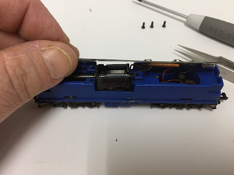](IMG_4099_big.jpeg)

  
Lo primero que vamos a eliminar es la placa de circuito impreso que soporta la iluminación con bombillas de filamento y un par de bobinas para el motor.  
  

[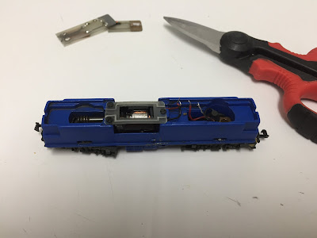](IMG_4100_big.jpeg)

  
Como esta placa también cumple la función de fijar el motor en su sitio, lo que vamos a hacer es recortarla para que lo que nos resta siga cumpliento esta función.  
  
Lo siguiente es apuntar el descodificador en algún lugar en el que pueda caber.  
  

[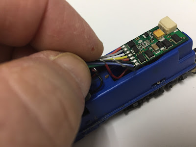](IMG_4101_big.jpeg)

  
Veo que vamos a tener que retirar parte del chasis metálico, así como el eje de plástico que sobresale del bogie. Este eje en el diseño original hace tope con la placa impidiendo que se desmonte la toma de corriente. Si vemos que el eje no encaja fuertemente en su base, tras limarlo deberemos fijarlo convenientemente con una gota de pegamento.  
  

[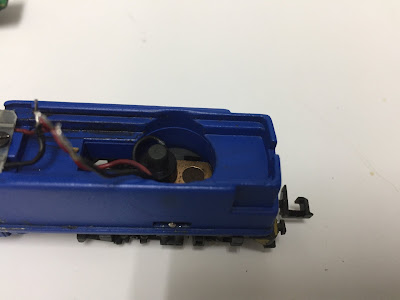](IMG_4102_big.jpeg)

  
Al trabajar con este chasis tenemos que tener cuidado con los detalles visibles que incluye, ya que sería muy difícil reconstruir la numeración.  
  

[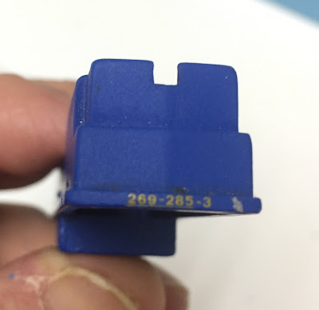](IMG_4109_big.jpeg)

  
Lo primero que he hecho es reducir ligeramente la parte frontal, para que no roce en los nuevos led inferiores.  

[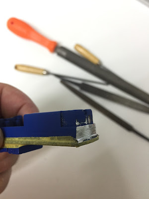](IMG_4111_big.jpeg)

  
Lo segundo eliminar un buen trozo del chasis para alojar el controlador.  
  

[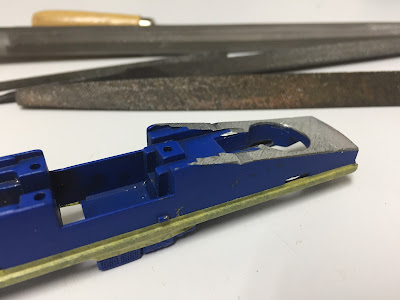](IMG_4114_big.jpeg)

  
Como podéis ver en la siguiente foto, he pintado lo limado para que no de tanta impresión al abrir la locomotora.  
  

[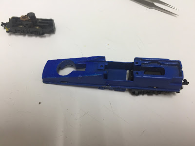](IMG_4115_big.jpeg)

  
Finalmente llega el momento de instalar el decodificador.  El que he seleccionado es un modelo [76425 de Uhlenbrock](http://www.uhlenbrock.de/de_DE/service/download/handbook/en/I4B050BD-057.apd/Bes76425e.pdf).  
  
El cableado del dispositivo es el siguiente:  
  

  
Lo primero que vamos a hacer es eliminar el conector, ya que no tenemos dónde usarlo. Yo también voy a eliminar el cable verde, ya que no voy a usar la función auxiliar y el espacio que tenemos es muy limitado. Concretamente lo he desoldado de la placa.  
  
Lo siguiente es conectar los cables de la toma de corriente. Para ello decidiremos hacia qué lado será el sentido natural de la locomotora y conectaremos el cable negro al lado izquierdo de la marcha y el cable rojo al lado derecho.  
  
Como el espacio es oro, intento dejar los cables con el largo justo, para que no molesten.  
  

[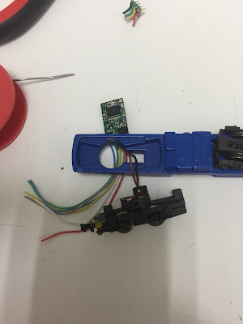](IMG_4116_big.jpeg)

  
Los siguientes son los cables del motor, naranja y gris.  
  

[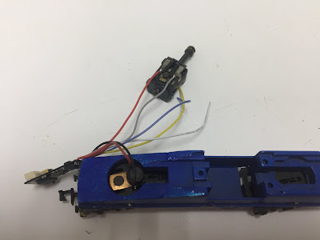](IMG_4117_big.jpeg)

  
Ya podemos fijar el motor en su lugar con el resto de la placa que cortamos al principio.  
  

[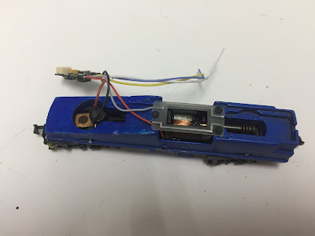](IMG_4118_big.jpeg)

  
Para evitar contactos accidentales, he protegido el descodificador con macarrón termoretráctil.  
  

[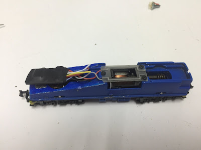](IMG_4119_big.jpeg)

  
Vemos que nos quedan libres los 3 cables de la iluminación. El azul es el hilo común de la iluminación. El blanco la iluminación delantera y el amarillo la trasera.  
  
Estamos usando led, por lo que es importante saber que el azul común es el positivo, mientras que blanco y amarillo nos van a dar el negativo. Por lo que tendremos que polarizar los diodos de esta forma.  
  
Para limitar la corriente, uso un par de  resistencias de 1K2 1/8W.  
  
Otra cosa a tener en cuenta es que estamos usando diferentes modelos de led, Si no queremos tener problemas con que unos se iluminen y otros no, deberemos conectarlos en serie. Si los conectáramos en paralelo usando una sola resistencia para limitar la corriente, las pequeñas diferencias en sus valores de polarización harían que algunos drenaran toda la corriente y otros no llegaran a polarizarse.  
  
A continuación un vistazo a la maraña de cables de los led, he tenido que usar unas pinzas para mantener los led en su sitio mientras que el pegamento fraguaba.  
  

[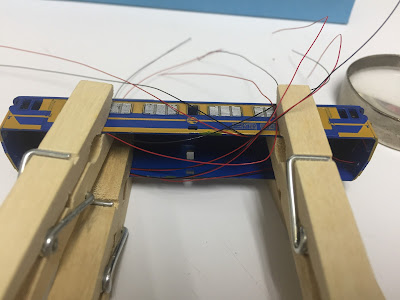](IMG_4120_big.jpeg)

  
Y finalmente todo ordenado tras conectar los diferentes led en serie y estos al decodificador.  
  

[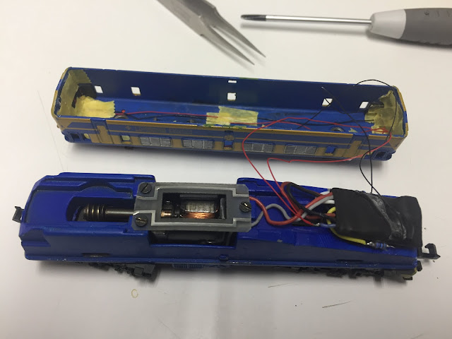](IMG_4124_big.jpeg)

  
Se puede apreciar como he usado cinta de enmascarar para ordenar los cables y las resistencias de polarización 1K2 1/8W alojadas a los lados del decodificador.  
  
He aquí foto y video del trabajo terminado:  
  

[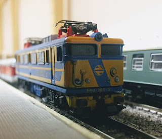](IMG_4159_big.jpeg)

