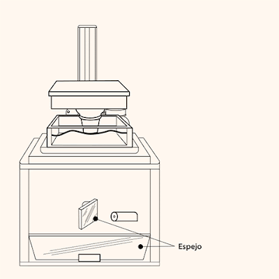
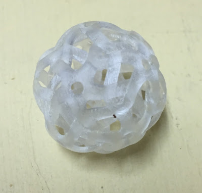

Hace algún tiempo adquirí una impresora [XYZ printing Nobel 1.0](https://www.amazon.es/gp/product/B00VX8LVT2/ref=as_li_tl?ie=UTF8&camp=3638&creative=24630&creativeASIN=B00VX8LVT2&linkCode=as2&tag=rpr0f-21&linkId=b6b9221491f018628a1c0f8cc4f4dccb) en amazon.es, ya que tenía el gusanillo de hacer cosas en la maqueta a escala N que por su detalle y tamaño no permite el PLA ni el ABS extruido.   

Imágen de http://eu.xyzprinting.com/eu\_es/Product/Nobel-1.0

La tecnología de fotopolimerización usa una resina fotosensible que es solidificada por un rayo laser. La ventaja de este sistema es que es mucho mas preciso que la extrusión, permitiendo un nivel de detalle mucho mayor. La desventaja es que es mucho mas caro.  
  

Hoy por fin he procedido a realizar la primer a prueba de impresión con uno de los modelos que ofrece el fabricante. Os dejo un vídeo.



Y he aquí la pieza terminada: 

El nivel de detalle es impresionante, tanto que la foto hecha con un iphone 6 no da para distinguirlo de verdad ¿Acabaré teniendo que comprar un equipo fotográfico?