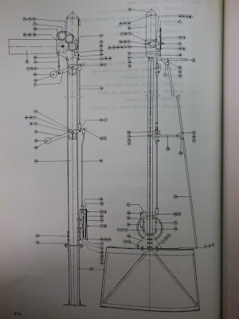
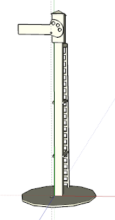
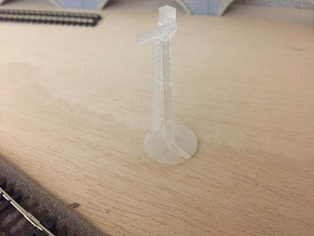

Hace un tiempo encontré por los foros un plano de los semáforos unificados de renfe. Un documento increible. La imagen original está disponible en: [www.forotrenes.es](http://www.forotrenes.com/foro/viewtopic.php?f=9&t=21701&hilit=blanes&start=340)  
  

  
  
Así que este fin de semana he estado robandole tiempo al sueño para construir un semáforo en escala N.  
  
Lo primero, ha sido pasar unas cuantas horas delante del SketchUp. Hasta que he conseguido lo siguiente:  
  

  
Por ahora es solo una prueba, pero la primera impresión ha sido muy satisfactoria. La pieza es una preciosidad.  
  

  
  
Os recuerdo que la impresora es una [XYZ printing Nobel 1.0](https://www.amazon.es/gp/product/B015SY9ST6/ref=as_li_tl?ie=UTF8&camp=3638&creative=24630&creativeASIN=B015SY9ST6&linkCode=as2&tag=rpr0f-21&linkId=dc4f8e30f5d4a73072d2384424d7b100) de fotopolimerización por laser. No sería posible obtener la precisión necesaria para esta pieza con una impresora normal de extrusión.