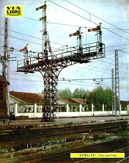
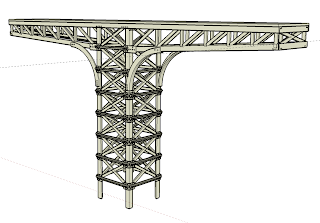
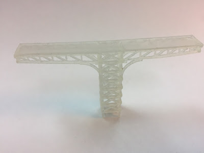

El fin de semana también hize pruebas para recrear un puente de señales como los de la antigua estación de Atocha.  

Así que tras 7 horas de trabajo delante del sketchup conseguí esto:  

Y he aquí como queda tras la impresión:  

Todavía queda trabajo por hacer, la valla superior, las señales, pero va teniendo muy buena pinta.