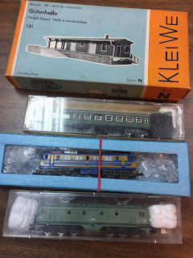
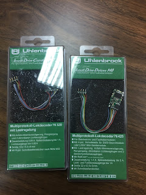

This weekend  (3/12/17) there have been the [model railways flea market](https://www.museodelferrocarril.org/findesemana/mercadillo.asp) that is organized each first Sunday of month.  
  
As a good shopaholic, I've come back with hands full of things:  
  
*   A warehouse building with loading bay from  Kleiwe.
*   A first class carriage [RENFE serie 8000](http://ferropedia.es/mediawiki/index.php/Renfe_Serie_8000)
*   An electric locomotive [RENFE 269](http://www.ferropedia.es/wiki/Renfe_Serie_269).
*   An electric locomotive [RENFE 276 (7600)](http://www.ferropedia.es/mediawiki/index.php/Renfe_Serie_276).

  
[ ](IMG_4096_big.JPG)

These two pre-loved locomotives are not digital, then I also bought two decoders. There are different [decoders from Uhlenbrock](https://www.amazon.co.uk/gp/product/B008RKQMMA/ref=as_li_tl?ie=UTF8&camp=1634&creative=6738&creativeASIN=B008RKQMMA&linkCode=as2&tag=littlerailway-21&linkId=e8441e0ab7f26fbfdebfc826916f495a) (I want to try it). And there are not for N gauge, because there are equipped with [NEM 652](http://www.dccwiki.com/Locomotive_Interface) for H0 gauge, but I've thought that the dimensions are correct.  
  
