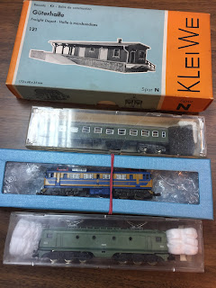
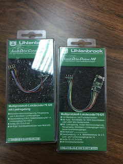

Este fin de semana (3/12/17) se ha celebrado el [mercadillo de modelismo ferroviario](https://www.museodelferrocarril.org/findesemana/mercadillo.asp) que organizan cada primer domingo de mes en el Museo Ferroviario de Madrid.  
  
Como buen comprador compulsivo, me he venido con las manos llenas de cositas:  
  

*   Un almacén de mercancías con muelle de carga de la mara Kleiwe.
*   Un coche de primera [RENFE serie 8000](http://ferropedia.es/mediawiki/index.php/Renfe_Serie_8000).
*   Una locomotora [RENFE 269](http://www.ferropedia.es/wiki/Renfe_Serie_269).
*   Una locomotora [RENFE 276 (7600) ](http://www.ferropedia.es/mediawiki/index.php/Renfe_Serie_276).

  

[ ](IMG_4096_big.JPG)

  
Las dos locomotoras de segunda mano no son digitales. Así que también me he hecho con dos decoders. Los dos diferentes (por probar), y ninguno para escala N, ya que llevan el conector [NEM 652](http://www.fcaf.cat/normes/nem/nem652_es.pdf) para H0, pero viendo las dimensiones parece que me pudieran servir.  
  

