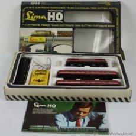
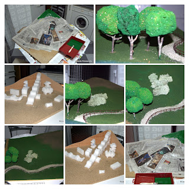
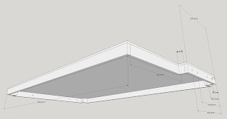
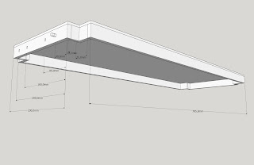
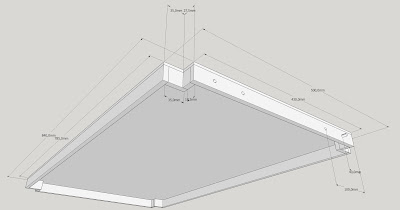
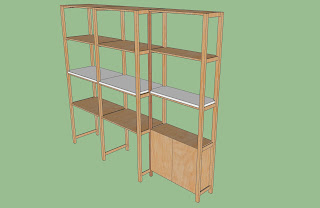
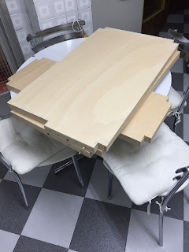

When I was seven, I received my first miniature train. A Lima H0 gauge kit what my parents gave to me for Christmas. Tracks laid over my mother's home hall. When I was 10 I had my first model over a fixed board about 3 sq meters with two concentric ovals that covered whole room. I remember pain in my arms because a whole afternoon sat on the floor cabling under board.  
  

  

The next milestone that I remember is a 2N3232 transistor with some resistors connected to the printer port of my Amstrad CPC to control the gauge. Of course, the printer port ceased to function in a few days.  
  
The whole rectangular board was splitted in several pieces, to make the model fit to the walls and left a central space for the spectators.  
  
I think that the last time when the model run was when I was 16. Since then, as I saw something similar, or read about it, I thought: "I know how to do it...."  

  
Sometimes I put my hands to work and done some dioramas like the above.  
  
Finally, a couple of months ago a work mate told me he was going to gift a starter kit to his brother... and again i thought "I know how to do it"... but this time, the trigger was stronger and i started to think how to do it.  
  
First thoughts were to use a full room for it again, with HO gauge. But i quickly had to discard this option. What about N gauge, which is almost half the size?... even so, i had not a free square meter at home.  
  
But once an idea pops into your mind, you cannot get it out. And i found that an Ikea modular shelf is good enough if you make room in one of their layers, and you get almost one and half square meter.  
  
Once the placement was chosen, i continued thinking about how to build up the layout. The shelf is made of fir wood, 16mm thick. You cannot work that material. Plus, the shelf would never be leveled as rooms floor are never perfect.  
  
The solution i worked is to make some panels to lay over the shelf. Then those panels assembled will make a hard solid base with a soft wood to work in.  
  
We need to make a bit of engineering to design the panels. I talked to some pals involved in 3D and CAD world and finally i chose sketchUp software to make my models. Why? cause the learning curve is not "so" exponential.  
  
So after a weekend of work, measuring, and fighting with my PC, I managed to get a design:  
  
  
  

  

  

  
  

  
  
Design's principal is to be removable. The joints among pieces are done with a couple of  dowel pins and two screws. Anyway on a first glance i have thought to install railwais without joints. If required, a bit of work with the Dremel will be enough.  
  
Another issue to consider is to avoid the columns of the shelf, so i did the cuts, wide enough to be able to lift the layout over one of its sides and work underneath.  
  
Items: fir sticks about 9x25mm and a plywood piece 9mm thick.  
  
As this is a weekend's job, i had to wait 5 days, and then i built it. And this is the outcome:  
  
  

