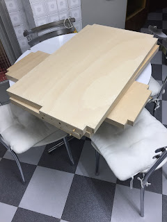

Cuando tenía siete años tuve mi primer tren eléctrico.  Un kit de Lima escala H0 que me regalaron por navidad. Las vías corrían por el salón de casa de mi madre. A los trece tuve mi primera maqueta montada sobre un tablero de unos 3 metros cuadrados con dos óvalos concéntricos que ocupaba toda la habitación de los trastos. De esta maqueta me acuerdo de lo que dolían los brazos de trabajar cableando debajo de ella sentado en el suelo.  
  

  
El siguiente hito que recuerdo es un transistor 2N3232 y 10 resistencias conectado a la salida de impresora del amstrad CPC para controlar la velocidad de la locomotora. Evidentemente el puerto de impresora dejó de funcionar a los pocos días.  
  
El gran tablero rectangular se dividió en múltiples piezas para hacer que rodeara toda la habitación y el puesto de mando estuviera en el centro.  
  
Creo que la última vez que la maqueta estuvo montada debía tener 16 o 17 años. Desde entonces cada vez que veía algo similar, o leía sobre ello, pensaba: "Yo lo se hacer..."  
  

  
  
Alguna vez me he liado la manta a la cabeza y he hecho algún escenario, como la foto de arriba.  
  
Bueno, pues hace un par de meses un compañero del trabajo me habló de que iba a regalar a su hermano un kit para iniciar una maqueta... Y volví a pensar: "Yo lo se hacer..." Pero esta vez el gusanillo fué un poco más fuerte y me puse a pensar cómo hacerla.  
  
Una idea era la de volver a dedicar una habitación a ella, otra vez en escala H0, pero eso por ahora se puede descartar. ¿Y en escala N que es casi la mitad? Aún así no tienes sitio para dedicar un metro cuadrado y medio por ningún lugar de la casa.  
  
Esto de tener una idea en la cabeza es lo que tiene, que sigues pensando. Al final la estantería modular de Ikea es un sitio dónde sí que puedes liberar una balda entera y sale casi un metro cuadrado y medio.  
  
Una vez elegido el sitio, seguí pensando cómo montar ahí la maqueta. La estantería es de madera de abeto. Los paneles son macizos de unos 16mm de grosor, ahí no se puede trabajar. Ademas la estantería nunca queda a nivel pues el suelo de las habitaciones nunca es perfecto.  
  
La solución que he encontrado es hacerme unos paneles que descansen sobre las baldas y que correctamente ensamblados aporten una base rígida y con una madera blanda para poder trabajar.  
  
Tenemos que hacer un poco de ingeniería y diseñar los paneles. Así que me puse a consultar a amigos metidos en el mundo del CAD y del diseño 3D y al final me decanté por el software sketchUp para hacer mis modelos. ¿Por qué? Pues porque la curva de aprendizaje no es "muy" exponencial.  
  
Tras un fin de semana de trabajo, medidas y peleas con el ordenador, finalmente conseguí tenerlo todo diseñado.  
  

  

  

  
  

  
  
El diseño se basa en que sea desmontable. Las uniones entre tableros se realiza mediante un par de tubillones y dos tornillos. Aunque en un primer momento tengo pensada la instalación de las vías sin uniones. En el caso de ser necesario, un toque de dremel sería suficiente.  
Otra cosa a tener en cuenta es salvar las columnas de la estantería, por eso los rebajes. con ancho suficiente para poder levantar la maqueta sobre uno de sus laterales y trabajar debajo de ella.  
  
Los materiales: listones de abeto de aproximadamente 9x25mm y tablero de contrachapado de 9mm.  
  
  
Esta es una ocupación de fines de semana. Así que tras una espera de cinco días, procedí a la construcción. Por suerte, en la oficina tenemos un garaje donde hay sitio para hacer "manualidades" fuera del horario laboral.  
  
Lo importante a la hora de construir los paneles es ser muy meticuloso con las medidas. Las herramientas: Serrucho y caja de ingletes para ser preciso a la hora de cortar los listones, taladro para los agujeros de tornillos y tubillones, martillo y clavos para ensamblar (Por suerte un compañero me dejó una clavadora con la que todo es mucho más fácil), cola para que todo quede mucho más rígido y lijadora para un buen acabado.  
  
He aquí el resultado:  
  

  
  

Dejo aquí los enlaces a los diseños de sketchup:

*   [Estantería](https://www.dropbox.com/s/dl7yidmmbadi03j/rack.skp?dl=0)
*   [Panel izquierdo ](https://www.dropbox.com/s/0tk2ymsycbhez24/leftBoard.skp?dl=0)
*   [Panel derecho](https://www.dropbox.com/s/m5zeojcllydm1ef/rightBoard.skp?dl=0)
*   [Panel central](https://www.dropbox.com/s/nm4vs3cgcd6gs02/centralBoard.skp?dl=0)