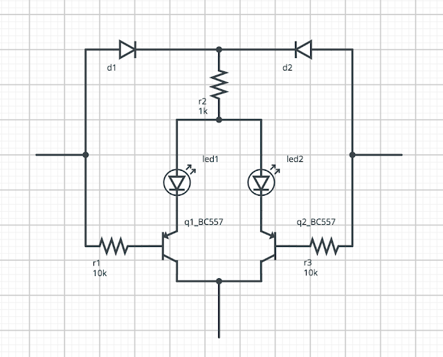

  

  
  
Al comprar unos semáforos de la marca Mafen, me he encontrado que vienen cableados con el ánodo común, y yo he pensado todos mis equipos para usar un cátodo común. Es decir: El común es la referencia de 0V.  
  

Ante la disyuntiva sobre que hacer, he estado pensando en una solución: Podría ponerme a quitar todas las resistencias de pullup en las salidas. Pero he estado pensando una solución menos dramática, es decir un conversor que me permita conectar el ánodo común a una salida con la masa  común.  
  
Buscando, he encontrado circuitos similares que usan un diodo para dejar pasar la corriente por los elementos que deberían esta apagados (recordemos, que al ser ánodo común esto es a +Vcc) para polarizar nuestros leds.  Esto unido a un transistor PNP polarizado de tal forma que maneje la salida, nos deja un conversor que permite utilizar nuestro ánodo común.  
  

